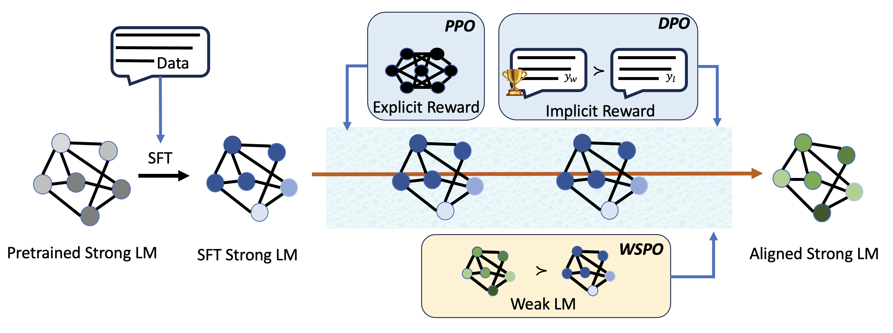
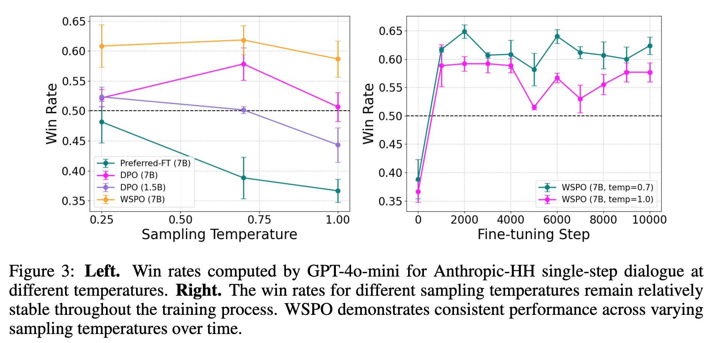

<div align="center">
<h1>Weak-to-Strong Preference Optimization: Stealing Reward from Weak Aligned Model
</h1>
Wenhong Zhu<sup>1,2</sup>, Zhiwei He<sup>1</sup>, Xiaofeng Wang<sup>1</sup>, Pengfei Liu <sup>1,2</sup>,  Rui Wang <sup>1</sup>

<sup>1</sup> Shanghai Jiao Tong Univerisity,   <sup>2</sup>Sii

[<a href="https://openreview.net/forum?id=f7KxfUrRSb">Paper</a>] | [<a href="https://github.com/zwhong714/weak-to-strong-preference-optimization">Code</a>]
</div>

---
## Introduction

We propose a method called Weak-to-Strong Preference Optimization (WSPO), which achieves strong model alignment by learning the distribution differences before and after the alignment of the weak model.

This is the official implementation of WSPO algorithm. 



## Installation

```bash
conda create -n wspo python=3.10
conda activate wspo
cd weak-to-strong-preference-optimization
pip install -e ".[torch,metrics]"
```

## Run Training

All experiments were conducted on a 4×H100 setup, each equipped with 80GB of memory. We present a specific case for performing the WSPO training. The models used include  `Qwen/Qwen2-1.5B` and `Qwen/Qwen2-7B`. 


### 1. Prepare Your Dataset
The dataset preparation method is described in  `weak-to-strong-preference-optimization/data/README.md`. For more examples, refer to [this link](https://github.com/hiyouga/LLaMA-Factory/tree/main/data).


### 2 LoRA Training  

#### 1. SFT Training

- We use `HuggingFaceH4/ultrachat_200k` to perform SFT training on the Base models `Qwen/Qwen2-1.5B` and `Qwen/Qwen2-7B`. Configure the settings in `examples/train_lora/qwen2_lora_sft.yaml`, then execute the following command.

```
llamafactory-cli train examples/train_lora/qwen2_lora_sft.yaml
```
- After training, merge the LoRA adapter weights with the model weights.  Configure the settings in `examples/merge_lora/qwen2_lora.yaml`, then execute the following command.
```
llamafactory-cli export examples/merge_lora/qwen2_lora.yaml
```

#### 2. DPO Training
We use `llamafactory/ultrafeedback_binarized` to perform DPO training on the SFT model `Qwen2-1.5B-SFT`. 

```
llamafactory-cli train examples/train_lora/qwen2_lora_dpo.yaml
```
- After training, merge the LoRA adapter weights with the model weights.
```
llamafactory-cli export examples/merge_lora/qwen2_lora.yaml
```

#### 3. WSPO Training
We use the `chosen` dataset in `llamafactory/ultrafeedback_binarized` for WSPO Training. No modifications are required to the `llamafactory/ultrafeedback_binarized` dataset. We use `Qwen2-1.5B-SFT` as the weak reference model, `Qwen2-1.5B-DPO` as the weak aligned model, and `Qwen2-7B-SFT` as the strong reference model to perform WSPO training and derive `Qwen2-7B-WSPO`.


```
llamafactory-cli train examples/train_lora/qwen2_lora_wspo.yaml
```
- After training, merge the LoRA adapter weights with the model weights.  
```
llamafactory-cli export examples/merge_lora/qwen2_lora.yaml
```


### 3 Full Fine-Tuning  

To set up the environment, install the required dependencies:  
```bash
pip install deepspeed==0.15.4
pip install transformers==4.45.0
```  
Training examples are available in the `weak-to-strong-preference-optimization/examples/train_full` folder.  


#### 1. SFT Training

- We use `HuggingFaceH4/ultrachat_200k` to perform SFT training on the Base models `Qwen/Qwen2-1.5B` and `Qwen/Qwen2-7B`. Configure the settings in `examples/train_full/qwen2_full_sft_ds3.yaml`, then execute the following command.

```
llamafactory-cli train examples/train_full/qwen2_full_sft_ds3.yaml
```


#### 2. DPO Training
We use `llamafactory/ultrafeedback_binarized` to perform DPO training on the SFT model `Qwen2-1.5B-SFT`. 

```
llamafactory-cli train examples/train_full/qwen2_full_dpo_ds3.yaml
```

#### 3. WSPO Training
We use the `chosen` dataset in `llamafactory/ultrafeedback_binarized` for WSPO Training. No modifications are required to the `llamafactory/ultrafeedback_binarized` dataset.


```
llamafactory-cli train examples/train_full/qwen2_full_wspo.yaml
```


## Performance




## Citation

```
@inproceedings{
zhu2025weaktostrong,
title={Weak-to-Strong Preference Optimization: Stealing Reward from Weak Aligned Model},
author={Wenhong Zhu and Zhiwei He and Xiaofeng Wang and Pengfei Liu and Rui Wang},
booktitle={The Thirteenth International Conference on Learning Representations},
year={2025},
url={https://openreview.net/forum?id=f7KxfUrRSb}
}
```


## Acknowledgments

- We run our experiments based on [LLama-Factory](https://github.com/hiyouga/LLaMA-Factory).

